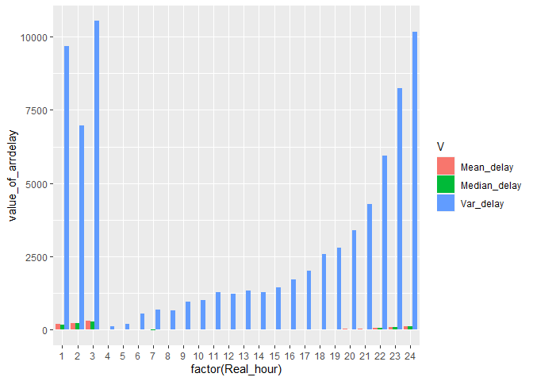
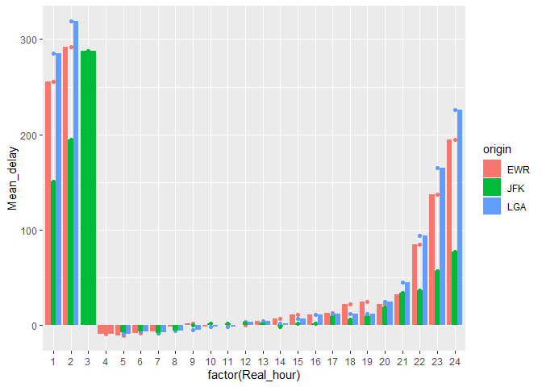
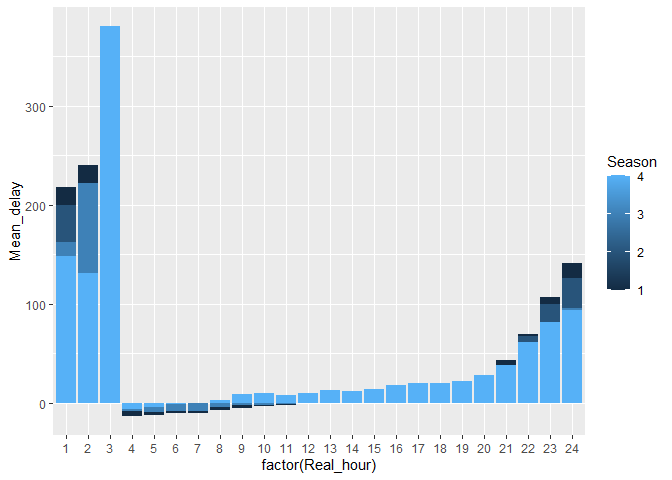
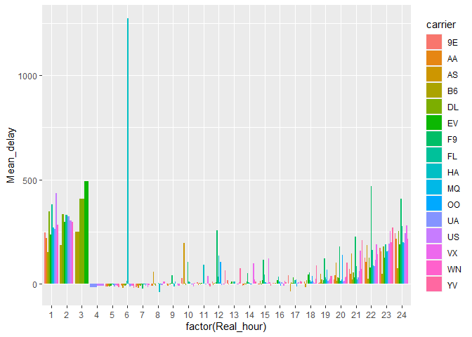
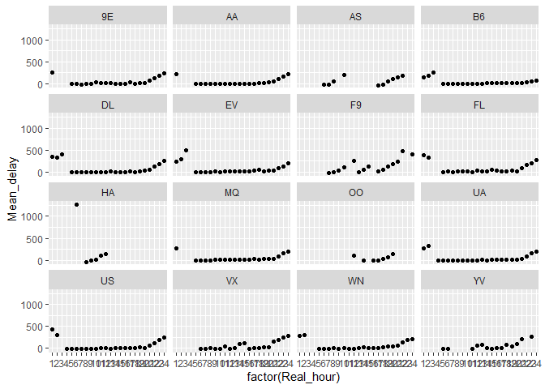

STAT433 HW2
================
Xinyi Shi
2022-10-08

``` r
library(dplyr)
```

    ## 
    ## 载入程辑包：'dplyr'

    ## The following objects are masked from 'package:stats':
    ## 
    ##     filter, lag

    ## The following objects are masked from 'package:base':
    ## 
    ##     intersect, setdiff, setequal, union

``` r
library(nycflights13)
```

    ## Warning: 程辑包'nycflights13'是用R版本4.2.1 来建造的

``` r
library(ggplot2)
```

What time of day should you fly if you want to avoid delays as much as
possible? Does this choice depend on anything? Season? Weather? Airport?
Airline? Find three patterns (“null results” are ok!). Write your
results into Rmarkdown. Include a short introduction that summarizes the
three results. Then, have a section for each finding. Support each
finding with data summaries and visualizations. Include your code when
necessary. This shouldn’t be long, but it might take some time to find
the things you want to talk about and lay them out in an orderly way.

## What time of day should you fly.(overview)

``` r
library(tidyr)
```

    ## Warning: 程辑包'tidyr'是用R版本4.2.1 来建造的

``` r
flights %>% 
  drop_na() %>%
  mutate(Real_hour = ifelse(dep_time%/%100>0, dep_time%/%100, 24),na.rm=TRUE) %>% 
  group_by(Real_hour) %>%
  summarise(Mean_delay=mean(arr_delay,na.rm=TRUE),Median_delay=median(arr_delay,na.rm=TRUE),Var_delay=var(arr_delay,na.rm=TRUE)) %>% 
  gather(V,value_of_arrdelay,Mean_delay:Var_delay) %>%
  ggplot(.,aes(x=factor(Real_hour),y=value_of_arrdelay,fill=V)) + geom_bar(stat = "identity",position='dodge')
```

<!-- -->

``` r
flights %>% 
  drop_na() %>% 
  mutate(Real_hour = dep_time%/%100,na.rm=TRUE) %>% 
  group_by(Real_hour) %>%
  summarise(Mean_delay=mean(arr_delay,na.rm=TRUE),Median_delay=median(arr_delay,na.rm=TRUE),Var_delay=var(arr_delay,na.rm=TRUE))
```

    ## # A tibble: 25 × 4
    ##    Real_hour Mean_delay Median_delay Var_delay
    ##        <dbl>      <dbl>        <dbl>     <dbl>
    ##  1         0     121.            111    10094.
    ##  2         1     196.            177     9667.
    ##  3         2     225.            209     6971.
    ##  4         3     288.            267    10539.
    ##  5         4      -8.88          -10      121.
    ##  6         5      -8.85          -10      205.
    ##  7         6      -7.09           -9      546.
    ##  8         7      -7.35          -11      680.
    ##  9         8      -4.03           -8      653.
    ## 10         9      -1.06           -7      954.
    ## # … with 15 more rows

From the plot and summary, we conclude that 3am has the longest
arr_delay time while 2am,1am,0am also has more than 2hours delay, if you
want to avoid delay we suggest you to take off at about 4\~10am.

From the aspect of median_delay and var_delay we can get the almost same
conclusion.

## Relationship between delay and airport（Origin）

For easier calculation, we compute by the aspect of mean.

``` r
flights %>% 
  drop_na() %>%
  mutate(Real_hour = ifelse(dep_time%/%100>0, dep_time%/%100, 24), na.rm=TRUE) %>% 
  group_by(Real_hour,origin) %>%
  summarise(Mean_delay=mean(arr_delay,na.rm=TRUE)) %>% 
  ggplot(aes(x=factor(Real_hour),y=Mean_delay,fill=origin)) +
  geom_point(aes(color=origin)) +
  geom_bar(stat="identity",position = "dodge")
```

    ## `summarise()` has grouped output by 'Real_hour'. You can override using the
    ## `.groups` argument.

<!-- -->

From the plot we find that expect the 3am only have JFK flights, LGA has
the longest arrive delay while JFK has the least.

## Relationship between delay and season.

For easier calculation, we compute by the aspect of mean.

``` r
flights %>% 
  drop_na() %>%
  mutate(Real_hour = ifelse(dep_time%/%100>0, dep_time%/%100, 24), na.rm=TRUE) %>% 
  mutate(Season = ifelse(month==12, 4, month%%3+1)) %>% 
  group_by(Real_hour,Season) %>%
  summarise(Mean_delay=mean(arr_delay,na.rm=TRUE)) %>% 
  ggplot(aes(x=factor(Real_hour),y=Mean_delay,fill=Season)) +
  geom_bar(stat="identity",position = "dodge")
```

    ## `summarise()` has grouped output by 'Real_hour'. You can override using the
    ## `.groups` argument.

<!-- --> generally, we
find that in winter we have the most delay(season 4), the reason maybe
snow or some other extreme weather. So try to avoid take flights in
winter.

## Relationship between delay and airline.

For easier calculation, we compute by the aspect of mean.

``` r
flights %>% 
  drop_na() %>%
  mutate(Real_hour = ifelse(dep_time%/%100>0, dep_time%/%100, 24), na.rm=TRUE) %>% 
  mutate(Season = ifelse(month==12, 4, month%%3+1)) %>% 
  group_by(Real_hour,carrier) %>%
  summarise(Mean_delay=mean(arr_delay,na.rm=TRUE)) %>% 
  ggplot(aes(x=factor(Real_hour),y=Mean_delay,fill=carrier)) +
  geom_bar(stat="identity",position = "dodge")
```

    ## `summarise()` has grouped output by 'Real_hour'. You can override using the
    ## `.groups` argument.

<!-- -->

``` r
flights %>% 
  drop_na() %>%
  mutate(Real_hour = ifelse(dep_time%/%100>0, dep_time%/%100, 24), na.rm=TRUE) %>% 
  mutate(Season = ifelse(month==12, 4, month%%3+1)) %>% 
  group_by(Real_hour,carrier) %>%
  summarise(Mean_delay=mean(arr_delay,na.rm=TRUE)) %>% 
  ggplot() + geom_point(mapping = aes(x = factor(Real_hour), y = Mean_delay)) + 
  facet_wrap(~ carrier)
```

    ## `summarise()` has grouped output by 'Real_hour'. You can override using the
    ## `.groups` argument.

<!-- -->

From the plot it is hard to see the difference in one plot, so we did it
seperately. We find that actually there are no big differences in those
airline..
