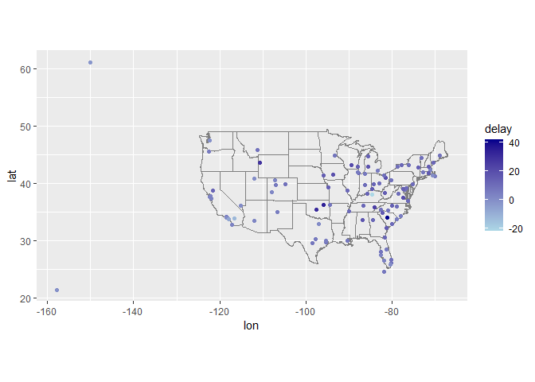
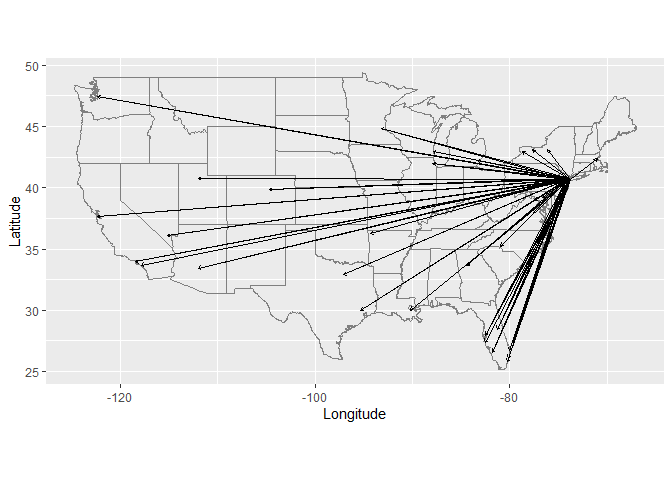
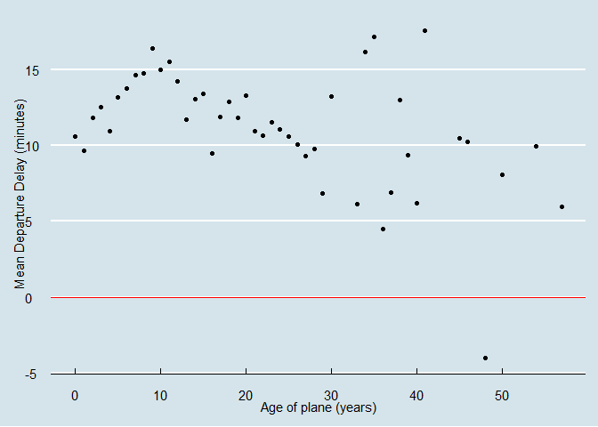
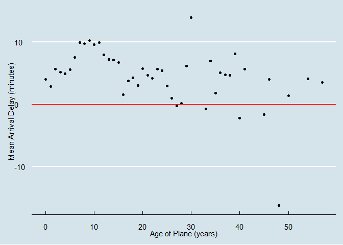

STAT433 HW3
================
Xinyi Shi
2022-10-17

``` r
library(dplyr)
```

    ## 
    ## 载入程辑包：'dplyr'

    ## The following objects are masked from 'package:stats':
    ## 
    ##     filter, lag

    ## The following objects are masked from 'package:base':
    ## 
    ##     intersect, setdiff, setequal, union

``` r
library(nycflights13)
```

    ## Warning: 程辑包'nycflights13'是用R版本4.2.1 来建造的

``` r
library(ggplot2)
library(tidyverse)
```

    ## Warning: 程辑包'tidyverse'是用R版本4.2.1 来建造的

    ## ── Attaching packages
    ## ───────────────────────────────────────
    ## tidyverse 1.3.2 ──

    ## ✔ tibble  3.1.7     ✔ purrr   0.3.4
    ## ✔ tidyr   1.2.1     ✔ stringr 1.4.1
    ## ✔ readr   2.1.3     ✔ forcats 0.5.2

    ## Warning: 程辑包'tidyr'是用R版本4.2.1 来建造的

    ## Warning: 程辑包'readr'是用R版本4.2.1 来建造的

    ## Warning: 程辑包'stringr'是用R版本4.2.1 来建造的

    ## Warning: 程辑包'forcats'是用R版本4.2.1 来建造的

    ## ── Conflicts ────────────────────────────────────────── tidyverse_conflicts() ──
    ## ✖ dplyr::filter() masks stats::filter()
    ## ✖ dplyr::lag()    masks stats::lag()

``` r
library(ggthemes)
```

    ## Warning: 程辑包'ggthemes'是用R版本4.2.1 来建造的

1.Compute the average delay by destination, then join on the airports
data frame so you can show the spatial distribution of delays. Here’s an
easy way to draw a map of the United States:

``` r
flights %>% 
  group_by(dest) %>% 
  summarise(delay = mean(arr_delay, na.rm=TRUE)) %>% 
  inner_join(airports, by = c(dest="faa")) %>%
  ggplot(aes(lon, lat, colour = delay)) +
  borders("state") +
  geom_point() +
  coord_quickmap() +
  scale_color_gradient(low="lightblue", high="darkblue")
```

<!-- --> You might want
to use the size or colour of the points to display the average delay for
each airport.

2.Add the location of the origin and destination (i.e. the lat and lon)
to flights.

``` r
airport_locations <- airports %>%
  select(faa, lat, lon)

airline <- flights %>%
  select(year:day, hour, origin, dest) %>%
  left_join(
    airport_locations,
    by = c("origin" = "faa")
  ) %>%
  left_join(
    airport_locations,
    by = c("dest" = "faa")
  )

airline
```

    ## # A tibble: 336,776 × 10
    ##     year month   day  hour origin dest  lat.x lon.x lat.y lon.y
    ##    <int> <int> <int> <dbl> <chr>  <chr> <dbl> <dbl> <dbl> <dbl>
    ##  1  2013     1     1     5 EWR    IAH    40.7 -74.2  30.0 -95.3
    ##  2  2013     1     1     5 LGA    IAH    40.8 -73.9  30.0 -95.3
    ##  3  2013     1     1     5 JFK    MIA    40.6 -73.8  25.8 -80.3
    ##  4  2013     1     1     5 JFK    BQN    40.6 -73.8  NA    NA  
    ##  5  2013     1     1     6 LGA    ATL    40.8 -73.9  33.6 -84.4
    ##  6  2013     1     1     5 EWR    ORD    40.7 -74.2  42.0 -87.9
    ##  7  2013     1     1     6 EWR    FLL    40.7 -74.2  26.1 -80.2
    ##  8  2013     1     1     6 LGA    IAD    40.8 -73.9  38.9 -77.5
    ##  9  2013     1     1     6 JFK    MCO    40.6 -73.8  28.4 -81.3
    ## 10  2013     1     1     6 LGA    ORD    40.8 -73.9  42.0 -87.9
    ## # … with 336,766 more rows

``` r
#We also write the first 100 line of the airline.
airline %>%
  slice(1:100) %>%
  ggplot(aes(
    x = lon.x, xend = lon.y,
    y = lat.x, yend = lat.y
  )) +
  borders("state") +
  geom_segment(arrow = arrow(length = unit(0.1, "cm"))) +
  coord_quickmap() +
  labs(y = "Latitude", x = "Longitude")
```

    ## Warning: Removed 5 rows containing missing values (geom_segment).

<!-- -->

``` r
airline
```

    ## # A tibble: 336,776 × 10
    ##     year month   day  hour origin dest  lat.x lon.x lat.y lon.y
    ##    <int> <int> <int> <dbl> <chr>  <chr> <dbl> <dbl> <dbl> <dbl>
    ##  1  2013     1     1     5 EWR    IAH    40.7 -74.2  30.0 -95.3
    ##  2  2013     1     1     5 LGA    IAH    40.8 -73.9  30.0 -95.3
    ##  3  2013     1     1     5 JFK    MIA    40.6 -73.8  25.8 -80.3
    ##  4  2013     1     1     5 JFK    BQN    40.6 -73.8  NA    NA  
    ##  5  2013     1     1     6 LGA    ATL    40.8 -73.9  33.6 -84.4
    ##  6  2013     1     1     5 EWR    ORD    40.7 -74.2  42.0 -87.9
    ##  7  2013     1     1     6 EWR    FLL    40.7 -74.2  26.1 -80.2
    ##  8  2013     1     1     6 LGA    IAD    40.8 -73.9  38.9 -77.5
    ##  9  2013     1     1     6 JFK    MCO    40.6 -73.8  28.4 -81.3
    ## 10  2013     1     1     6 LGA    ORD    40.8 -73.9  42.0 -87.9
    ## # … with 336,766 more rows

3.Is there a relationship between the age of a plane and its delays?

``` r
plane_cohorts <- inner_join(flights,
  select(planes, tailnum, plane_year = year),
  by = "tailnum"
) %>%
  mutate(age = year - plane_year) %>%
  filter(!is.na(age)) %>%
  group_by(age) %>%
  summarise(
    dep_delay_mean = mean(dep_delay, na.rm = TRUE),
    dep_delay_sd = sd(dep_delay, na.rm = TRUE),
    arr_delay_mean = mean(arr_delay, na.rm = TRUE),
    arr_delay_sd = sd(arr_delay, na.rm = TRUE),
    n_arr_delay = sum(!is.na(arr_delay)),
    n_dep_delay = sum(!is.na(dep_delay))
  )

ggplot(plane_cohorts, aes(x = age, y = dep_delay_mean)) +
  geom_point() +
  geom_hline(aes(yintercept=0),color="red") +
  scale_x_continuous("Age of plane (years)", breaks = seq(0, 60, by = 10)) +
  scale_y_continuous("Mean Departure Delay (minutes)") +
  theme_economist()
```

<!-- -->

``` r
ggplot(plane_cohorts, aes(x = age, y = arr_delay_mean)) +
  geom_point() +
  geom_hline(aes(yintercept=0),color="red") +
  scale_x_continuous("Age of Plane (years)", breaks = seq(0, 60, by = 10)) +
  scale_y_continuous("Mean Arrival Delay (minutes)") +
  theme_economist()
```

<!-- -->

To solve this problem, we first join the data in “Plane” with “Flights”
to get the tailnum and planes’ age. Then, we calculate the mean of
arr_delay and dep_delay by the group of “plane’s age”. By observing the
2 plots, we found there is almost no strong relationship between the
plane’s age and its delay time.
